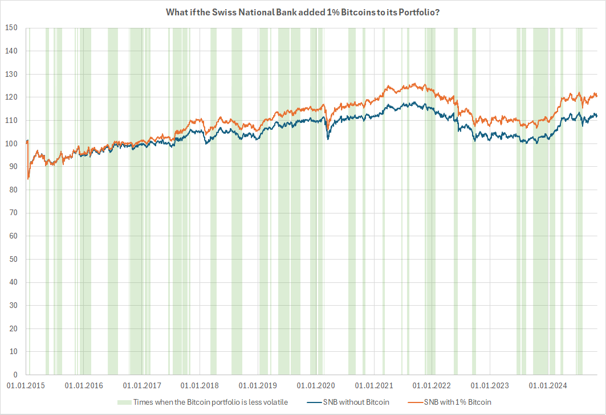

# SNB Portfolio Simulation with Bitcoin

## Abstract

This project is about finding out how adding bitcoins to the portfolio of the Swiss National Bank impacts its performance and volatility. We find that, looking at the past 10 years, adding 1% bitcoins would have lifted the hypothetical portfolio's return over that period from 13% to 22%. At the same time, adding Bitcoins would have increased the portfolio's average annualized five-day volatility from 7.32% to 7.44%. About 32% of the time, the portfolio with bitcoins would even have been less volatile than the portfolio without bitcoins.

## Method

As the exact composition of the SNB's portfolio is not known, we approximated it based on the 2024 annual report using the components: gold, MSCI World, five-year dollar government bond returns, and five-year euro government bond returns.

The used data was downloaded from the following source:

- [Forexsoftware](https://forexsb.com/historical-forex-data) for historical daily gold, euro and dollar quotes.
- [St. Louis Fed](https://fred.stlouisfed.org/series/DGS5) for historical daily dollar yields on US treasuries at a five-year constant maturity
- [Europen Central Bank](https://data.ecb.europa.eu/data/datasets/YC/YC.B.U2.EUR.4F.G_N_A.SV_C_YM.SR_5Y) for historical daily euro yields on government bonds at a five-year constant maturity
- [Crypto Data Download](https://www.cryptodatadownload.com/cdd/Bitstamp_BTCUSD_d.csv) for historical daily bitcoin prices source from Bitstamp
- [Swiss National Bank](https://www.snb.ch/en/news-publications/annual-report/annual-report-2024) for approximate portfolio weights

At the end of 2024, the Swiss National Bank held 832 billion francs worth of currency reserves. Out of that, 78 billion was gold. From the remaining 754 billion, we assumed 25% to be held in shares and the remaining amount to be split half in euro and half in dollar bonds, ignoring all other currencies. We approximate the performance of the shares with the MSCI world index. The two bond portfolios are approximated based on the five-year yields in each currency.

To calculate the performance of the portfolio, that resulting relative composition was assumed throughout the whole period. This corresponds to daily friction-less rebalancing. The daily performance for bonds is based on the exchange rate change, the earned interest (even if in reality there is no daily payout), and the change in the discounted value of the apprecaion of the five-year bond based on the interest change of that day.

For the portfolio with bitcoins, bitcoins was added with a weight of 1%, proportionally reducing the weights of all the other components.

The performance of the portfolio was only calculated for days for which all components had data. Consequently, trading data for bitcoin over weekends was discarded, such that the period from Friday to Monday is considered "one day" for returns, while still accumulating three days worth of interest.

Current volatility is based on the variance of weekly (five day) returns over a window of three weeks. To avoid the typical artefacts of rolling windows, an exponential moving average was used, giving the latest sample a weight of 1/15 and the latest 15 samples a weight of 50%, with the sample weights exponentially decaying.

## Result

The portfolio with bitcoin clearly outperformed the portfolio without, with a slightly increased volatility. Looking at the magnitude of daily returns, the portfolio with bitcoin saw larger daily changes on 53% of the days and was calmer 47% of the time. Average weekly volatility increased marginally from 7.32% to 7.44% (annualized) when allocating 1% of the portfolio to bitcoin, starting 2015-01-01. Looking at five-day return volatility with a rolling window of 15 days, volatility was lower for the portfolio with Bitcoin about 32% of the time.

## Running the Calculations

1. Clone this repository to your computer
2. Import the folder as Maven project into eclipse
3. Run 'Composition.java'

Any other way of cloning and running a Java program is also possible. Note that the project was compiled with the latest version of Java (Java 24) and might use features that are not available in earlier versions.
